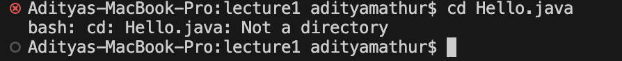
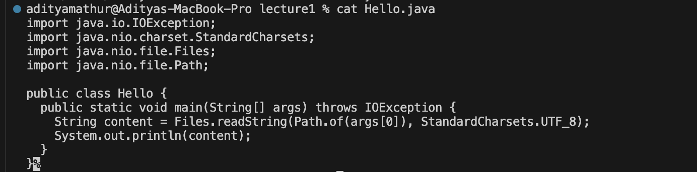

# Lab Report 1 \
##`cd` \
**1. `cd` command with no arguments:** \
 \
absolute path *before* command: /Users/adityamathur \
explanation: the output returns nothing because `cd` stands for "change directory." since there was no arguments, there was nothing to change. \
\
**2. `cd` command with directory as argument:** \
 \
absolute path *before* command: /Users/adityamathur \
explanation: `cd` with a directory as the argument adds the argument to the working directory. 

**3. `cd` command with file as argument:**

absolute path *before* command: /Users/adityamathur/lecture1
explanation: an error arises because `cd` only changes the directory and a file is not a directory.

---

##`ls`
**1. `ls` command with no arguments:**

absolute path *before* command: /Users/adityamathur/lecture1
explanation: `ls` with no arguments lists all the files within the working directory as seen in the image.

**2. `ls` command with directory as argument:**

absolute path *before* command: /Users/adityamathur/lecture1
explanation: `ls` with a directory as the argument lists all files within the directory in the argument.

**3. `ls` command with file as argument:**

absolute path *before* command: /Users/adityamathur/lecture1
explanation: `ls` with a file as the argument lists descriptions about the file such as name, size, etc.

---

##`cat`
**1. `cat` command with no arguments:**

absolute path *before* command: /Users/adityamathur/lecture1
explanation: an error occurs because the `cat` command displays the contents of a file however there is no file specified.

**2. `cat` command with directory as argument:**

absolute path *before* command: /Users/adityamathur/lecture1
explanation: an error occurs because the `cat` command displays the content of a file however a directory is the argument, not a file.

**3. `cat` command with file as argument:**

absolute path *before* command: /Users/adityamathur/lecture1
explanation: the `cat` command displays the content of the file that was specified in the argument. 

