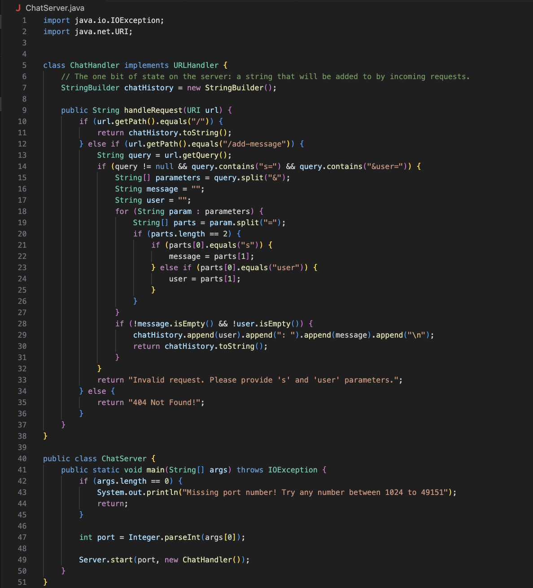
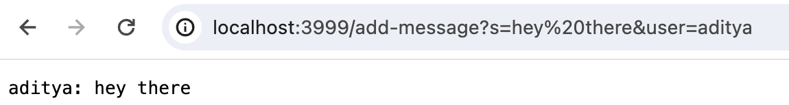
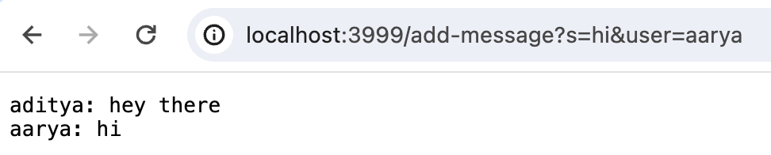
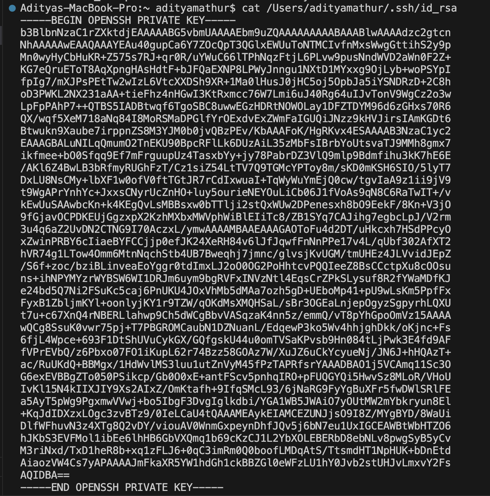

# Lab Report 2
## ChatServer.java \

\
\
## First example using ChatServer: \

**Which of the methods in your code are called?** /
In ChatServer.java, the methods `main(String[] args)` and `handleRequest(URI url)` are called. \
In Server.java, the methods `start(int port, URLHandler handler` and `handle(HttpExchange exchange)` are called. \
/
**What are the relevant arguments to those methods, and the values of any relevant fields of the class?** \
Relevant arguments and fields of `main(String[] args)`: \
  1. Relevant arguments: `args` is the array of command-line arguments passed to the program. In this case, \
     it contains the port number as `args[0]`. \
  2. Relevant fields: none \
\
Relevant arguments and fields of `handleRequest(URI url)`: \
  1. Relevant arguments: `url` is the URI object representing the HTTP request URL. It contains information \
     about the requested path, query parameters, etc. \
  2. Relevant fields: `StringBuilder chatHistory` = "aditya: hey there\n" \
\
**How do the values of any relevant fields of the class change from this specific request? \
If no values got changed, explain why.** \
The chatHistory field in the ChatHandler class changes to include the new message from user "aditya". However, the handler field \
in the ServerHttpHandler class remains unaffected as it is set when the server starts and remains constant. \
\
\
## Second example using ChatServer: /
 
**Which of the methods in your code are called?** /
In ChatServer.java, the methods `main(String[] args)` and `handleRequest(URI url)` are called. \
In Server.java, the methods `start(int port, URLHandler handler` and `handle(HttpExchange exchange)` are called. \
/
**What are the relevant arguments to those methods, and the values of any relevant fields of the class?** \
Relevant arguments and fields of `main(String[] args)`: \
  1. Relevant arguments: `args` is the array of command-line arguments passed to the program. In this case, \
     it contains the port number as `args[0]`. \
  2. Relevant fields: none \
\
Relevant arguments and fields of `handleRequest(URI url)`: \
  1. Relevant arguments: `url` is the URI object representing the HTTP request URL. It contains information \
     about the requested path, query parameters, etc. \
  2. Relevant fields: `StringBuilder chatHistory` = "aditya: hey there\naarya: hi\n"
\
**How do the values of any relevant fields of the class change from this specific request? \
If no values got changed, explain why.** \
The chatHistory field in the ChatHandler class changes to include the new message from users "aditya" and "aarya." However, the handler field \
in the ServerHttpHandler class remains unaffected as it is set when the server starts and remains constant. \
\
---
# Part 2
 

