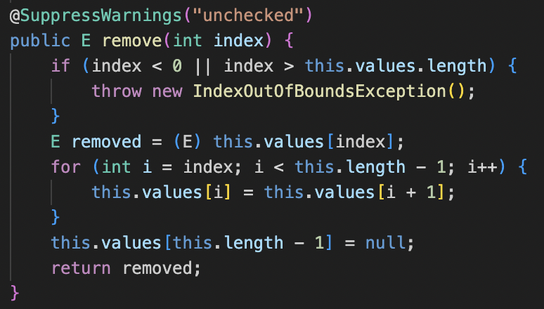
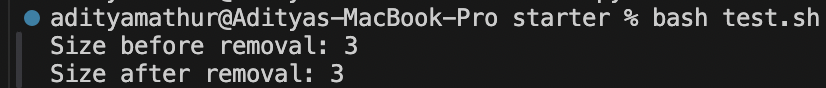

# Lab 5 Report
## Debugging Scenario
**Student A**: *Error in Remove Method for Array List Object* \
Hi. I am implementing code creating my own Array List object and methods to manipulate this object. However, I am \
running into issues with my `remove` method which removes a specified object from the array list. As seen in the attachment, \
when I run my main method which tests the length of an array list before and after the `remove` method is called, the length \
of the list does not seem to change. Here is the remove method and output of the terminal: \

 \
 \
**TA**: *Help with Remove Method* \
Hi there, could you try using the `jdb` debugger and iterate line through line of your main method to see the `length` variable \
and how it changes/if it changes throughout the call of the `remove` method? \
 \
 \
**Student A**: *Used jdb debugger*
I used the `jdb` debugger to iterate through my main method line by line to see how the `length` variable changes. It looks like there is nowhere in the `remove` method that actually decrements the `length` variable. So the bug would be not having a `length--;` \before returning the new array list with the 
